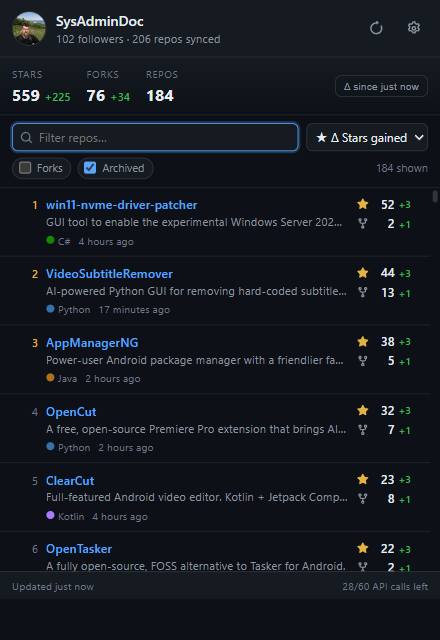
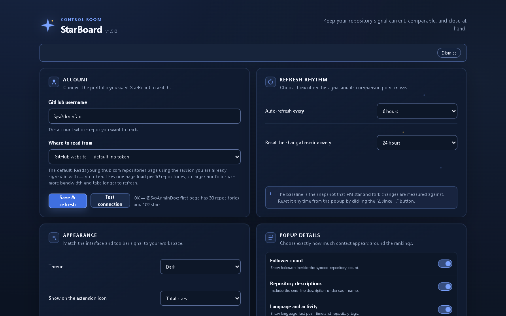
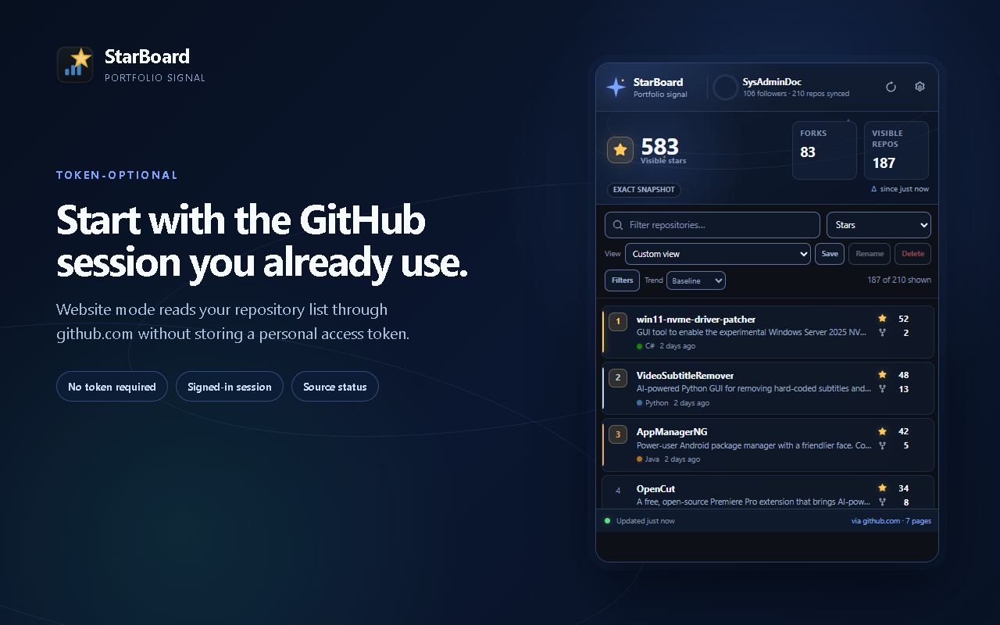

# StarBoard

[](https://github.com/SysAdminDoc/StarBoard/releases)
[](LICENSE)
[](#install)
[](manifest.json)

One click on the toolbar shows every repo you own, ranked most stars to least —
and how many stars and forks each one has picked up since you last looked.

<p align="center">
  
</p>

## Why

GitHub gives you no single place to see where all of your projects stand. Your
profile page paginates, sorts badly, and shows you a total — never a *change*.
StarBoard answers the two questions you actually open GitHub for: **which of my
projects are doing best**, and **what moved since yesterday**.

### Why it still works

On **2026-06-30** GitHub restricted the `/stargazers` endpoint to repository
admins and collaborators. Every tool that draws a star-history *curve* does it
by reading that endpoint and reconstructing the past from who starred when — so
for repositories you do not administer, that approach no longer has data to
work from.

StarBoard never used it. It records a snapshot of the counts it can see, keeps
them locally, and compares snapshots. That means:

- **It keeps working for any account**, because it only reads counts that are
  public on the profile page or returned by the ordinary repository listing.
- **It can show a count going down.** Reconstructed curves are cumulative by
  construction and cannot represent a star being removed. A snapshot diff can,
  and StarBoard renders negative deltas as readily as positive ones.
- **It only knows what it has watched.** The trade is honest and stated in the
  UI: there is no history before you installed it, ranges longer than the data
  retained are marked unavailable, and a gap is drawn as a gap rather than
  interpolated into a number that was never measured.

No token ever leaves your browser. There is no server, no account, and no
telemetry — the API token, if you choose to use one, is sent only to
`api.github.com` and stored only in your own profile.

## Features

- **Ranked instantly** — all repos sorted by stars, descending, the moment the popup opens.
- **Full board** — open the same board in Chrome's side panel to keep it visible
  while you switch tabs; the toolbar popup remains a compact glance view.
- **Change tracking** — green `+3` / `+1` badges next to each repo's stars and forks, measured against a baseline snapshot you control.
- **Offline trends** — compare portfolio and per-repository movement over 7,
  30 or 90 days from bounded local history: one year of daily points followed
  by a compact weekly archive for older coverage; ranges longer than the data
  retained are marked unavailable.
- **Multiple accounts** — switching the configured GitHub username keeps each
  account's snapshot, baseline, trend history, saved views and local alert
  preferences in its own namespace; existing single-account data migrates on
  first use.
- **Portable by choice** — download a checksummed JSON backup or timestamped
  CSV, dry-run restores before applying them, and roll back an import for 10
  minutes.
- **Commit-friendly history** — export a bounded 7-, 30- or 90-day machine-readable
  history report plus a self-contained SVG trend badge. Both are generated locally;
  the JSON is also shaped for Shields endpoint badges, and neither artifact contains
  credentials.
- **Supportable without surveillance** — inspect and copy a redacted local
  diagnostics snapshot without enabling telemetry or sending data anywhere.
- **Alerts on your terms** — opt into local portfolio/repository star
  milestones or minimum-growth alerts, with quiet hours, cooldowns and
  restart-safe deduplication.
- **Sort by momentum** — order by *stars gained* or *forks gained* to see what is actually moving, not just what is already big.
- **Live totals** — aggregate stars, forks and repo count, each with its own delta.
- **Honest confidence** — exact, approximate, partial and stale snapshots are
  labeled, filtered totals state their scope, and repository additions,
  removals and API-detected renames remain visible until acknowledged.
- **Toolbar badge** — total stars, or stars gained since the baseline, on the extension icon.
- **Saved portfolio views** — combine search and sort with language, visibility,
  fork/archive, count-precision, lifecycle and last-push filters; save up to 12
  named views, then rename or delete them with undo.
- **Two data sources** — your signed-in github.com session with **no token at
  all** by default, or the GitHub API for lower bandwidth and private repos.
- **Release details** — opt in to the latest release tag, relative age and
  cumulative downloads across its assets. API mode reads the metadata through
  GraphQL or one REST request per repository; website mode labels it explicitly
  unavailable instead of showing a blank column.
- **Private repos** — supported when you add a token.
- **Background refresh** — configurable interval, with a conservative 12-hour
  website default and six-hour automatic minimum.
- **Purpose-built portfolio UI** — a compact night-observatory dashboard, a
  crisp daylight theme and a match-system option.
- **Your preferred signal density** — independently show or hide follower
  count, descriptions, language and activity, fork statistics, and source
  quota details.
- **No telemetry.** The only hosts it ever contacts are `api.github.com` and, in web mode, `github.com`.

## Make it yours

The popup can stay information-rich or become a quieter leaderboard. Every
supporting detail has its own switch, while theme, refresh rhythm, baseline
cadence and toolbar-badge behavior remain independently configurable.

<p align="center">
  
</p>

## Install

StarBoard publishes an unsigned ZIP for Chrome Web Store upload or unpacked
installation:

1. Download `StarBoard-vX.Y.Z.zip` from [Releases](https://github.com/SysAdminDoc/StarBoard/releases) and unzip it (or clone this repo).
2. Open `chrome://extensions` and turn on **Developer mode**.
3. Click **Load unpacked** and select the folder.
4. Click the StarBoard icon → **Open settings** → enter your GitHub username →
   **Save & refresh**, then accept the one-time permission to read github.com.

Works in Chrome, Edge, Brave and other Chromium browsers (Manifest V3, Chrome 120+).
Each release also includes a SHA-256 checksum, a per-file hash manifest and an
SPDX 2.3 JSON SBOM. StarBoard never generates a packing key or self-signed CRX.

## Data sources

Pick one in **Settings → Where to read from**. New profiles start with the
website source; an existing installation keeps its saved source choice.

### GitHub website (default, no token)

Reads your own repositories tab — `github.com/<you>?tab=repositories` — using the
session you are already signed in with, and parses it into the same data the API
returns. No token, no registration, nothing to paste.

The first time you save or select this source, Chrome asks permission to read
`github.com`. The permission remains optional in the manifest and is only
requested from that explicit user action.

One honest caveat:

- **It costs more bandwidth.** One page load per 30 repos (~12× the API's
  payload for the same data), fetched one page at a time. Requests time out and
  retry serially, deduplicate rows, and stop at a documented 50-page /
  1,500-repository safety cap. If a later page fails or GitHub markup drifts,
  StarBoard labels the retained result partial instead of presenting it as
  complete.

Star and fork numbers are identical to the API's. The repositories tab renders
full counts — `241,273`, not `241k` — so there is no precision penalty at any
size (verified 2026-07-31 against a 241,000-star repository). The test suite
asserts exact parity across every repo, so a GitHub markup change fails loudly
instead of quietly reporting wrong numbers, and if GitHub ever does start
abbreviating, affected repos are labeled approximate rather than silently
rounded.

<p align="center">
  
</p>

### GitHub API (secondary)

| | Requests/hour | Private repos |
|---|---|---|
| No token | 60 (shared per IP) | No |
| `public_repo` scope, or fine-grained w/ read-only **Metadata** | 5,000 | No |
| `repo` scope | 5,000 | Yes |

A full refresh of a 200-repo account costs 3–4 requests. Tokens use
`chrome.storage.session` by default and are sent only to `api.github.com`.
API mode uses the endpoint's CORS policy and requests no host permission; only
the optional website mode asks for `github.com` access.
Persistent storage is available as an explicit warned choice, with a dedicated
**Forget token** action.

Use the API source when you want lower bandwidth, a documented rate-limit
budget, or private repositories through a token. Otherwise the website source
is the recommended zero-setup choice.

## What StarBoard cannot show

StarBoard is a local snapshot board, not a GitHub analytics service. Each source
has deliberate limits:

- **Website mode** can see only the repositories that GitHub renders on the
  signed-in repositories page. It cannot see private repositories that page
  does not expose, API quota, release downloads, traffic, or anything that was
  not present when StarBoard refreshed. It also cannot provide stargazer
  identities or historical star counts for repositories you do not administer.
- **API mode** without a token cannot see private repositories. With a token it
  can see only the repositories and fields that GitHub authorizes for that
  token; it still does not provide stargazer identities, third-party historical
  star counts, traffic, or snapshots from before StarBoard was installed and
  first refreshed.

Stargazer identities and third-party star history are unavailable through the
supported GitHub access paths after GitHub's 2026-06-30 restriction. StarBoard
does not ask for a workaround or scrape those records. No token is ever
required. If you choose API mode, a token is transmitted only to
`api.github.com`; website mode uses your existing `github.com` session without
reading or storing its cookie values.

## Privacy and permissions

StarBoard has no developer telemetry, analytics, advertising, remote backend
or third-party data sharing. Its network destinations are `api.github.com`,
`github.com` only after website mode is selected and access is granted, and
`sysadmindoc.github.io` only for the credential-free capability status check.
API mode does not request host access for either GitHub host.
The manifest intentionally declares no `web_accessible_resources`, so web pages
cannot probe the extension for exposed files. If a future feature needs one,
the release check requires every declared entry to opt into Chrome's
`use_dynamic_url` protection.

- **Data kept locally:** your username, display preferences, repository/profile
  snapshot, comparison baseline, daily/weekly trend points, refresh metadata and
  recovery metadata, saved portfolio views, alert preferences and bounded
  alert-delivery state stay in this Chromium profile until you clear them or
  uninstall StarBoard. Account data is kept in separate local namespaces, so
  switching usernames does not blend their snapshots or history.
- **Website session:** Chromium attaches applicable `github.com` cookies to the
  website-source requests. StarBoard never reads or stores cookie values; it
  parses only the returned repository/profile HTML.
- **API credentials:** PATs use `chrome.storage.session` by default and clear
  with the browser session. Persistent storage is an explicit, warned choice.
  Tokens are sent only to `api.github.com`, omitted from diagnostics and
  exports, and removable from both stores with **Forget token**.
- **Clearing and recovery:** clearing names the repository snapshot,
  comparison baseline, daily history and queued alert-delivery state it will
  remove, requires a second activation, and keeps one local undo snapshot for
  10 minutes. Settings, alert preferences and credentials remain untouched.
- **Portable files:** JSON backup and CSV export are user-initiated only.
  Private repository names and trend history each require an unchecked-by-
  default opt-in. Saved views are included; without the private-name opt-in,
  known private repository names are redacted from view names and searches.
  PATs are always omitted, and restore preserves the credential already held by
  this browser profile.
- **Committed artifacts:** history JSON and SVG badge exports follow the same
  private-name choice. They contain only bounded counts, dates, visibility and
  confidence metadata; no settings, cookies, session values or PATs are copied.

### CSV column contract

The CSV export is meant to be scripted against, so its columns are a versioned
contract rather than whatever the writer happened to emit. Every file — and
every row in it — declares the version, and the filename carries it too
(`StarBoard-repositories-v1-YYYY-MM-DD.csv`):

| # | Column | Type | Notes |
|---|--------|------|-------|
| 1 | `schema_version` | integer | Currently `1`. Present on every row. |
| 2 | `captured_at` | ISO 8601 UTC | Snapshot time, or the history point's time. |
| 3 | `repository` | `owner/name` | |
| 4 | `visibility` | `public` \| `private` | Private rows require the opt-in. |
| 5 | `stars` | integer | |
| 6 | `forks` | integer | |
| 7 | `stars_delta` | integer or empty | **Empty means no comparable point**, never zero. |
| 8 | `forks_delta` | integer or empty | Same. |
| 9 | `source` | `api` \| `web` | |
| 10 | `confidence` | `exact` \| `approximate` \| `partial` \| `stale` | |

**The promise:** within one `schema_version`, these columns are never removed,
reordered or retyped, and new columns are only ever appended to the right — so a
reader indexing by position keeps working. Anything that would break such a
reader increments the version instead. Files are UTF-8 with a BOM, CRLF line
endings, every field quoted per RFC 4180, and leading `=+-@` guarded against
spreadsheet formula injection.
- **Diagnostics:** the local support snapshot allow-lists only version, browser
  floor, source, permission, schema, storage-size, refresh, retry, confidence,
  normalized error-code and alarm metadata. It excludes tokens, cookies,
  usernames, repository names, URLs, raw HTML and raw error messages.
- **Required permissions:** `storage` keeps local state, `alarms` runs the
  selected refresh/retry schedule, and `offscreen` provides `DOMParser`. The
  secondary API source uses CORS and needs no host permission.
- **Optional permissions:** `https://github.com/*` is requested only from a
  user action when the website source is selected. `notifications` is requested
  only when local alerts are turned on; alerts are disabled by default.

The checked-in [store listing contract](store-listing.json) is the source of
truth for permission justifications, privacy disclosures and release
screenshots.

## Backup, restore and CSV

Open **Settings → Local data** to download a portable file:

- **Download JSON** creates a format-versioned backup of settings, the current
  snapshot, baseline, saved portfolio views and local alert preferences. Its
  SHA-256 checksum covers the full non-secret payload. History and private
  repository names remain excluded unless you explicitly select their separate
  inclusion boxes.
- **Export CSV** writes timestamped repository star/fork counts, deltas, source
  and confidence. With history selected it exports the retained daily series;
  otherwise it exports the current snapshot against the comparison baseline.
- **Download history JSON** emits `StarBoard-history-v1-{days}d-YYYY-MM-DD.json`.
  It includes a `repositories` series and portfolio points, and its top-level
  `schemaVersion`, `label`, `message` and `color` fields are compatible with
  Shields' endpoint badge format.
- **Download SVG badge** emits `StarBoard-badge-{days}d-YYYY-MM-DD.svg`, a
  standalone image with no external fonts, images, scripts or network references.
  Choose the 7-, 30- or 90-day window beside the two buttons before downloading.
- **Restore JSON…** verifies the checksum, rejects credentials and unsupported
  records, runs storage migrations and shows a dry-run record summary. Nothing
  changes until **Apply restore** is clicked; the prior state can then be
  restored with **Undo last data action** for 10 minutes.

Files never contain a PAT. A restore keeps the credential already stored in
the current profile and replaces only records present in the backup.

## Local diagnostics

**Settings → Local data → Build diagnostics** creates an inspectable JSON
snapshot entirely in the extension page. It reports the extension/browser
version contract, active/configured source, optional permission state, storage
schema and size, last successful/attempted refresh, confidence/completeness,
retry time, normalized error code and both refresh alarms. **Copy** places that
already-redacted text on the clipboard. No diagnostic is uploaded
automatically—or at all—by StarBoard.

## Local notifications

Open **Settings → Notifications** and turn on **Allow local alerts** to make
Chrome request its optional notification permission. Portfolio and individual
repository thresholds are independent: choose recurring star milestones,
minimum gains between successful refreshes, choose all repositories or an
individual selected/muted repository list, or set any threshold to **Off**.
Quiet hours and the cooldown are evaluated locally.

Alerts are generated only from a newly committed successful refresh.
Approximate/partial portfolio totals and approximate repositories are skipped,
and failed refreshes never generate an alert. A grouped Chrome notification may
summarize several events, but every event remains readable under **Recent
alerts** in the popup until you dismiss the inbox. Notified/unread event IDs are
bounded and persisted so a Manifest V3 worker restart cannot repeat the same
group; if the 50-alert local inbox fills, the popup states how many older events
could not be retained. Turning alerts off immediately clears the inbox without
changing the saved thresholds.

## How the deltas work

The **baseline** is a frozen snapshot of every repo's star and fork count. All
`+N` figures are the difference between live counts and that snapshot.

It is deliberately *not* overwritten on every refresh — if it were, every delta
would read `+0` forever. It rolls forward on the schedule you pick in settings
(default: every 24 hours), or immediately when you click the **`Δ since …`**
button in the popup to start counting from now.

Resetting that baseline requires a second activation and can be undone for 10
minutes. The same recovery window applies when clearing the cached snapshot and
baseline from Settings; starting another destructive action replaces the prior
undo snapshot.

When a personal access token is configured, the ranked listing is fetched with
one GraphQL query per 100 repositories instead of one REST request per 100, and
GitHub does the ranking server-side. REST cannot: `sort=stars` returns HTTP 200
and silently ignores the parameter. Without a token nothing changes — GraphQL
answers 403 unauthenticated — and any GraphQL failure REST can survive falls
back to REST automatically. GraphQL is a POST and carries no ETag, so a refresh
on that lane always transfers its payload where a REST refresh can answer 304
for free; automatic sweeps on it are therefore held to a 15-minute floor.
Manual refreshes are not.

The popup's **Trend** selector instead reads retained daily points for 7, 30 or
90-day comparisons without contacting GitHub. Numeric API repository IDs keep
renames connected across time; website-only changes remain explicit
additions/removals. A dash means no retained point exists for that repository
and range—StarBoard does not interpolate it as exact. History keeps at most one
point per repository per UTC day for 365 days, then consolidates older points
into one Monday-anchored weekly point per week for up to 520 weeks. Weekly
consolidation uses the last observed value for cumulative counts; an explicit
missing value stays missing, never averaged or carried forward. Both tiers
share the same bounded dictionary and the same 20% of the local-storage quota
reported by the browser (2 MiB on Chrome's 10 MiB quota), so storage stays
bounded regardless of how long the extension is installed. Ranges longer than
the data actually retained are shown as unavailable rather than returning a
column of dashes, and a range that stops being retained falls back to the
longest one the history can still serve. Settings can prune it to a shorter
window with undo.

While a day range is selected, each row draws an inline SVG sparkline of that
repository's retained star counts — no charting library, no network. Missing
days break the line into separate segments rather than being drawn through, and
a series with fewer than five retained points shows the point count instead,
because a two-point line only encodes "up or down". Every sparkline carries a
label stating its range, its measured endpoints, the change and how many days
are missing. Sparklines add no focus stops to the list; the **Trend table**
control beside Filters opens the same series as a real table.

That table is also the comparison view: biggest movers first, with each
repository's start and end star counts, absolute change, percentage growth and
fork change over the selected range. Growth from a start of zero is reported as
`from 0` rather than an invented percentage, a `~` marks any count GitHub
abbreviated, and the days-measured column is muted whenever the series has
holes. The set compared is whatever the current search, filters and saved view
leave visible, capped at 50 rows — the caption says how many were excluded. The
**Trend** selector also accepts a custom range in days, bounded by what the
history actually retains; asking for more is clamped to the retained window and
announced rather than silently returning dashes.

## Development

```bash
py -3.12 -m pip install -r requirements-icons.txt
py -3.12 scripts/make_icons.py   # regenerate toolbar icons
py -3.12 scripts/build.py        # build ZIP, checksums and SPDX SBOM
npm ci                           # exact dev-tool lock (nothing ships in the artifact)
npm run check                    # syntax, JSON, version and pseudo-locale alignment
npm run locales                  # regenerate the en_XA pseudo-locale from en
npm run typecheck                # tsc --checkJs over src/ and scripts/, no emit
node tests/unit.mjs              # deterministic storage/refresh/request checks
node tests/firefox.mjs           # advisory web-ext lint + Firefox smoke when installed
py -3.12 tests/release_test.py   # isolated, reproducible release validation
node tests/smoke.mjs             # drive the real popup against the live API
node tests/smoke.mjs --zip       # same, against the built artifact
node tests/smoke.mjs --no-web    # skip the (slower) scraping checks
```

`tests/unit.mjs` covers storage migrations and recovery, refresh coalescing,
and request timeout/backoff without network access. `tests/smoke.mjs` loads the
extension into a throwaway Chromium profile, seeds
settings, performs a real fetch, and asserts on ordering, deltas, filtering,
sorting, source defaults, popup-detail switches, the toolbar badge, the options
page, credential handling, lifecycle/confidence labels, offline history ranges,
portable-file privacy, import rollback, destructive-action recovery, worker
termination, diagnostics redaction, notification opt-in/deduplication and both
themes, plus saved-view filtering and recovery — 90 checks. It
hits the live GitHub API unauthenticated (3–4 of your 60 hourly requests); set
`GITHUB_TOKEN` to use the authenticated limit.

The web-mode half runs in a second browser with `https://github.com/*` promoted
from an optional to a declared permission, because the consent bubble is native
UI that automation cannot click. Every line of fetch, pagination and parsing
logic still executes for real; only the consent step — which must stay human in
production — is bypassed.

The notification lane similarly copies the extension into a throwaway build
with `notifications` promoted from optional to declared so automation can test
real OS-notification creation without clicking a native permission bubble.

The Firefox lane is advisory while the Firefox port is still parked. It creates
an ephemeral manifest that removes Chrome-only offscreen and side-panel
surfaces, runs `web-ext` lint, and, when Firefox is installed, opens an
extension-page smoke check for storage, i18n and packaged UI resources. It does
not claim Firefox store readiness or AMO publication.

### Field kill-switch

A Chrome Web Store review takes days to weeks, so a broken adapter or a removed
upstream field could not previously be turned off for installed users without
shipping a release and waiting. StarBoard reads one small static JSON from
[its own GitHub Pages branch](https://sysadmindoc.github.io/StarBoard/) at most
once every six hours:

```json
{ "formatVersion": 1,
  "issuedAt": 1785686400000,
  "expiresAt": 1785772800000,
  "capabilities": [
    { "name": "web-source", "fixedInVersion": "1.6.0", "reason": "markup changed" }
  ],
  "signature": {
    "algorithm": "Ed25519",
    "keyId": "2026-08",
    "value": "base64url-signature"
  } }
```

A rule applies only to installs older than `fixedInVersion`, so it lifts itself
as soon as the fixing release is installed — no second publish. The document can
only switch one of a fixed, locally-defined list of capabilities *off*; it never
enables anything, and names outside that list are discarded. Before any rule is
used, the extension verifies the Ed25519 signature against its baked key
allow-list and rejects unsigned, invalid, future-dated or expired documents.
It carries no code, no selectors and no URLs, nothing is ever evaluated, and the
request is credential-free and sends nothing about you or your repositories.
GitHub Pages answers `Access-Control-Allow-Origin: *`, so this needs no host
permission. If the file is unreachable, malformed, oversized, unsigned,
invalidly signed or expired, the extension is left exactly as it was; local
diagnostics reports only the bounded attempt outcome and timestamps.

CI uses the immutable npm lock, audits high-severity advisories, validates the
release twice for byte identity, and boots the packaged ZIP without network
access. Dependencies are reviewed manually — there is no Dependabot or Renovate
configuration. Live API/web parity remains a local release check because CI must
not depend on GitHub quota or credentials.

**No dependency ships inside the extension.** The released ZIP contains only
StarBoard's own files; Playwright, web-ext, TypeScript and Pillow exist for
tests, type checking and icon generation and are never bundled or loaded at runtime. The
SPDX SBOM emitted next to each build lists them explicitly as `TEST_TOOL_OF`,
`DEV_TOOL_OF` and `BUILD_TOOL_OF` with `filesAnalyzed: false`, so a scanner
reading the document can tell they are build-time components rather than
attributing their advisories to the shipped artifact.

### Layout

```
manifest.json        MV3 manifest
src/popup.*          the ranked list UI
src/options.*        settings page
src/background.js    service worker — owns every fetch, the alarm and the badge
src/offscreen.*      hidden DOM host; web mode's parser lives here
src/lib/github.js    REST client: pagination, rate limits, error mapping
src/lib/scrape.js    github.com HTML -> the same shape github.js returns
src/lib/request.js   timeout, Retry-After and bounded retry policy
src/lib/refresh-coordinator.js  refresh intent serialization/coalescing
src/lib/lifecycle.js repository add/remove/rename event derivation
src/lib/history.js   bounded daily/weekly history and offline trend comparisons
src/lib/notifications.js local milestone evaluation and delivery deduplication
src/lib/portfolio-views.js bounded saved views and repository filter predicates
src/lib/transfer.js  checksummed backup/restore, CSV and committable history export
src/lib/diagnostics.js allow-listed local support metadata
src/lib/storage.js   versioned settings/cache/baseline persistence and recovery
scripts/build.py     reproducible unsigned ZIP, hashes and SPDX packaging
scripts/make_icons.py  icon generation
tests/unit.mjs       deterministic state, refresh and request checks
tests/smoke.mjs      end-to-end browser test
```

## License

MIT — see [LICENSE](LICENSE).
